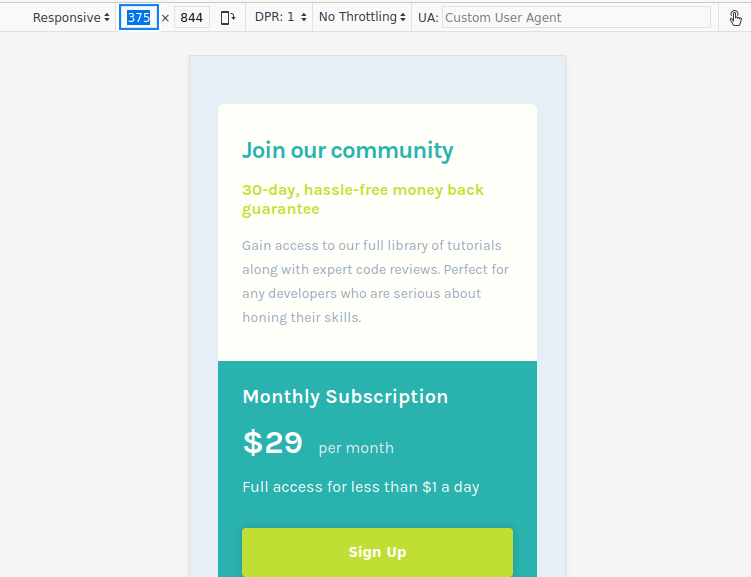
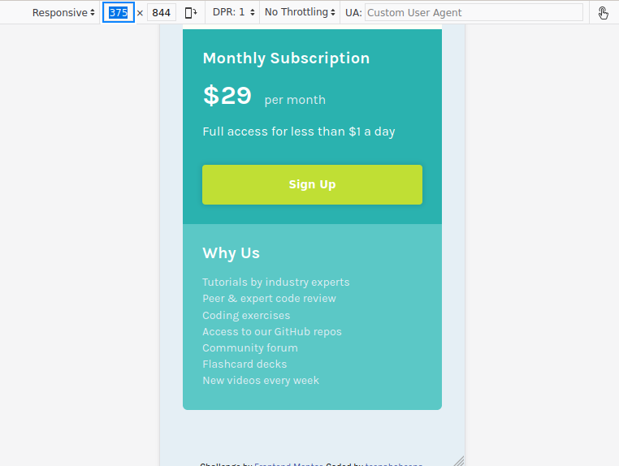
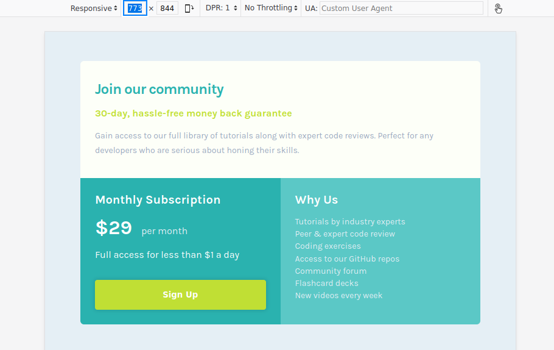
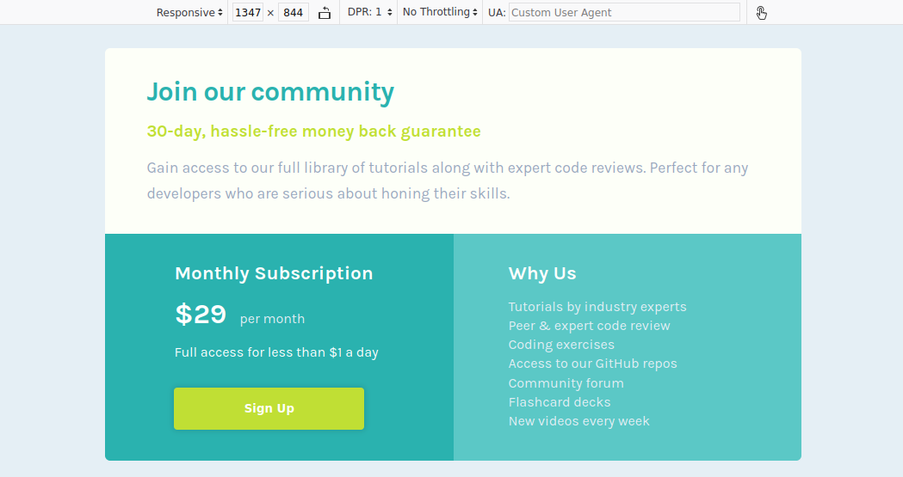

# Frontend Mentor - Single price grid component solution

This is a solution to the [Single price grid component challenge on Frontend Mentor](https://www.frontendmentor.io/challenges/single-price-grid-component-5ce41129d0ff452fec5abbbc). Frontend Mentor challenges help you improve your coding skills by building realistic projects. 

## Table of contents

- [Overview](#overview)
  - [The challenge](#the-challenge)
  - [Screenshot](#screenshot)
  - [Links](#links)
- [My process](#my-process)
  - [Built with](#built-with)
  - [What I learned](#what-i-learned)
  - [Continued development](#continued-development)
  - [Useful resources](#useful-resources)
- [Author](#author)

## Overview

### The challenge

Users should be able to:

- View the optimal layout for the component depending on their device's screen size

### Screenshot






### Links

- Solution URL: [Add solution URL here](https://your-solution-url.com)
- Live Site URL: [Add live site URL here](https://your-live-site-url.com)

## My process

### Built with

- Semantic HTML5 markup
- CSS custom properties
- CSS Grid
- Mobile-first workflow

### What I learned

I learned how to use the :first-child and :nth-child pseudo-selectors to target each of the sections:


```css
section:first-child {
    background-color: rgb(253, 255, 248);
    margin-top: 3rem;
    padding: 2rem 1.5rem;
    border-top-left-radius: 6px;
    border-top-right-radius: 6px;
}

section:nth-child(2) {
    background-color: var(--cyan);
    padding: 1.5rem;
}

section:nth-child(3) {
    background-color: hsl(179, 50%, 57%);
    padding: 1.5rem;
    border-bottom-left-radius: 6px;
    border-bottom-right-radius: 6px;
}
```

I learned how to use the adjacent sibling combinator to select the p element that directly follows the h1 element and is an immediate sibling of that h1 element:

```css
h1 + p {
    color: var(--yellow);
    font-weight: 700;
}
```

### Continued development

Moving forward, I will better learn how to create a grid, how to set the rows and columns, and how to place items in the grid.

I also want to learn what changes need to be made when going from mobile to desktop, such as font size and margins.

### Useful resources

- [W3Schools CSS Grid](https://www.w3schools.com/css/css_grid.asp) - This helped me figure out how to set up the grid and how to place the items the way I want.

## Author

- Website - [GitHub Pages](https://github.io/teenabobeena)
- Frontend Mentor - [@LadyLucyfurr](https://www.frontendmentor.io/profile/LadyLucyfurr)
- Twitter - [@chr1st1nac0des](https://www.twitter.com/chr1st1nac0des)